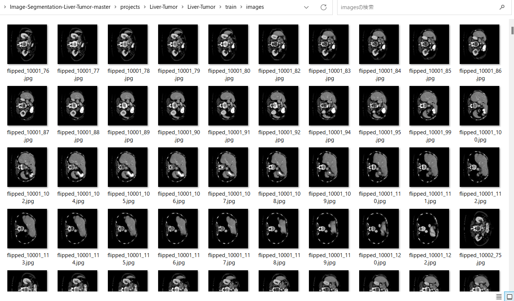
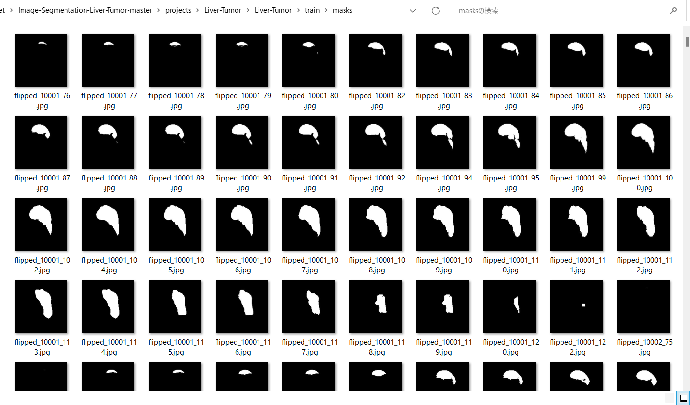
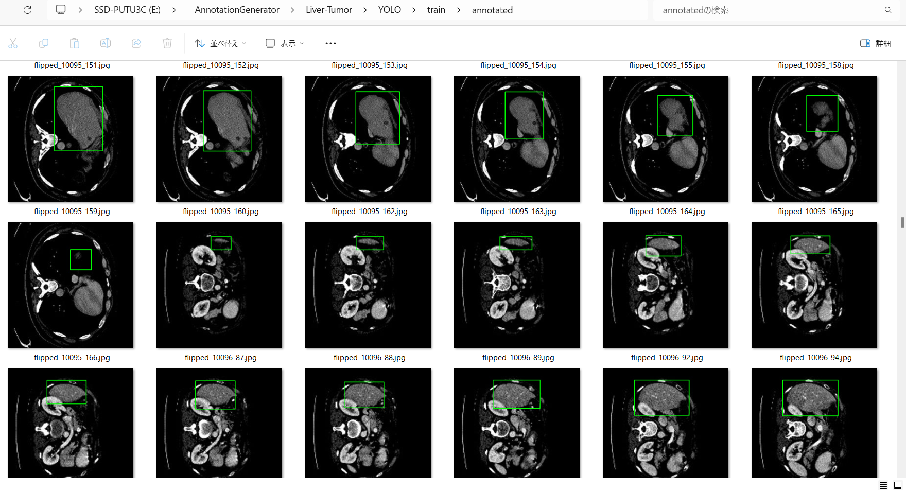

<h2>Liver-Tumor-Image-Dataset (2024/01/21)</h2>
This is a Liver-Tumor dataset for Image Segmentation and Object Detection.   
Please see also our first experiment <a href="https://github.com/sarah-antillia/Image-Segmentation-Liver-Tumor">
Image-Segmentation-Liver-Tumor
</a> 

<h3>1. Dataset Citatioin</h3>

The image dataset used here has been taken from the following web site.

<pre>
3D Liver segmentation
https://www.kaggle.com/datasets/prathamgrover/3d-liver-segmentation
</pre>
<b>About Dataset</b>
<pre>
Use this dataset for segmenting the liver tumor in 3D scans. The imagesTr files contains nifti images 
which are input for this image. Each nifti image contains multiple 2D slices of a single scan.
labelsTr contains the output for the corresponding input specifying where the tumor is localised.
</pre>
<b>License</b> 
<a href="https://opendatacommons.org/licenses/dbcl/1-0/">
Open Data Commons
</a>

<h3>
2. Download master dataset
</h3>
  Please download the original image and mask dataset <b>3D Liver segmentation</b> from the following link 

<pre>
3D Liver segmentation
https://www.kaggle.com/datasets/prathamgrover/3d-liver-segmentation
</pre>
</pre>
The dataset <b>3D Liver segmentation</b> has the following folder structure. 
<pre>
./Task03_Liver_rs
├─imagesTr
└─labelsTr
</pre>
These folders contain 300 liver_*.nii files respectively. 
<h3>
3. Create ImageMask Ddataset
</h3>
<h3>
3.1 Create base dataset
</h3>
Please run Python script <a href="./generator/create_base.py">create_base.py</a>.
to create jpg image and mask files. 
<pre>
>python create_base.py
</pre>
, by which Liver-base dataset will be created. 
<pre>
./Liver-base
├─images
└─masks
</pre>

<h3>
3.2 Create image and mask master dataset
</h3>

By using Python script <a href="./generator/ImageMaskDatasetGenerator.py">ImageMaskDatasetGenerator.py</a>,
 we have created <b>Liver-Tumor-master</b> dataset from the <b>Liver-Base</b> dataset. 
The script performs the following image processings. 
<pre>
1 Create 256x256 square images from original jpg files in <b>Tumor-base/images</b> folder..
2 Create 256x256 square mask  corresponding to the Tumor-base images files. 
3 Create flipped and mirrored images and masks of size 256x256 to augment the resized square images and masks.
</pre>

The created <b>Liver-Tumor-master</b> dataset has the following folder structure. 
<pre>
./Liver-Tumor-master
 ├─images
 └─masks
</pre>

<h3>
3.3 Split master to test, train and valid 
</h3>
By using Python script <a href="./projects/Liver-Tumor/generator/split_master.py">split_master.py</a>,
 we have finally created <b>Liver-Tumor</b> dataset from the <b>Liver-Tumor-master</b>. 
<pre>
./Liver-Tumor
├─test
│  ├─images
│  └─masks
├─train
│  ├─images
│  └─masks
└─valid
    ├─images
    └─masks
</pre>

<b>train/images samples:</b> 

 
<b>train/masks samples:</b> 

 
 

<h3>
4.Generate Annotation file
</h3>
<h3>
4.1 Generate YOLO Annotation
</h3>
To generate YOLO Anntotation files from the Liver-Tumor datasets, 
please run Python script <a href="./YOLOAnnotationGenerator.py">YOLOAnnotationGenerator.py</a>. 
<pre>
python YOLOAnnotationGenerator.py
</pre>

This command generates the following YOLO folders, which contains <b>test</b>, <b>train</b> and <b>valid</b> 
<pre>
./YOLO
├─test
│  └─annotated
├─train
│  └─annotated
└─valid
    └─annotated
</pre>
For example, train folder contains a lot of jpg image files, yolo annotation text files, and annotated folder,
 
<pre>
train
├─annotated
├─flipped_10001_100.jpg
├─flipped_10001_100.txt
├─flipped_10001_102.jpg
├─flipped_10001_102.txt
...
</pre>
Annotated folder contains jpg image files with bounding boxes as shown below. 
 
 

<h3>
4.2 Generate TFRecord train and valid dataset
</h3>
By using <a href="https://github.com/sarah-antillia/AnnotationConverters">AnnotationConverter</a>,
we have generated TFRecord dataset from train and valid dataset in YOLO annotation. 
<pre>
TFRecord
├─train
└─valid
</pre>

<h3>
4.3 Generate COCO test dataset
</h3>
By using <a href="https://github.com/sarah-antillia/AnnotationConverters">AnnotationConverter</a>,
we have generated COCO dataset from <b>test</b> dataset in YOLO annotation. 
<pre>
COCO
└─test
</pre>

<h3>
5. Liver-Tumor Dataset for EfficientDet
</h3>
We have finally created the following <b>Liver-Tumor-EfficientDet-Dataset</b> for 
<a href="https://github.com/google/automl/tree/master/efficientdet">efficientdet</a> object detection from TFRecord(train, valid) and COCO(test) dataset.
<pre>
Liver-Tumor-EfficientDet-Dataset
├─test
├─train
└─valid
</pre>

You can download this dataset from the googole drive 
<a href="https://drive.google.com/file/d/1P0-fafL1Xs-59D3Flh-pYPmRPOqln32W/view?usp=sharing">
Liver-Tumor-EfficientDet-Dataset.zip</a>

